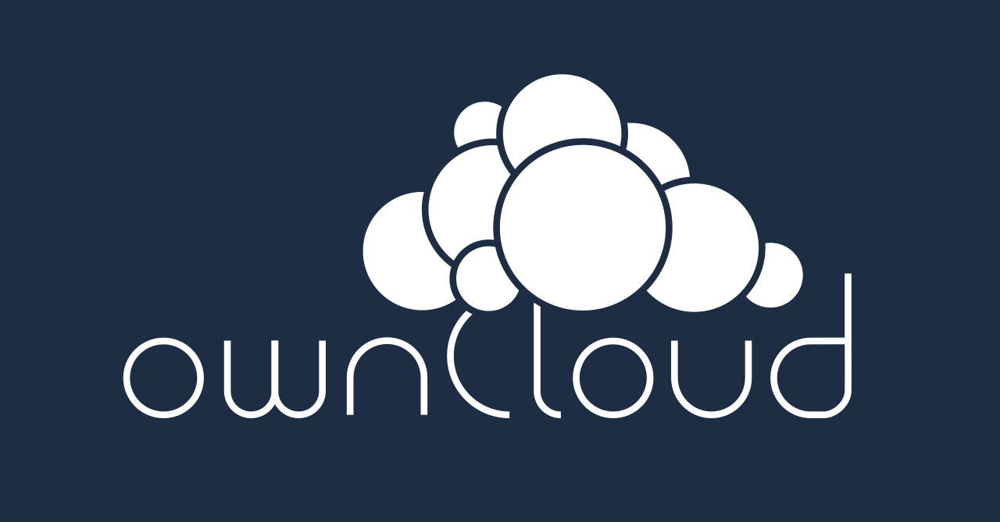

<!-- _class: invert -->

<!-- # Nextcloud fit -->

---
<!-- _class: invert -->

# Sommaire

- Nextcloud ?
- Historique de Nextcloud
- Principales fonctionnalités
- Installation et configuration de notre serveur Nextcloud

---
<!-- _class: invert -->

# Nextcloud ?

- Logiciel d'auto-hébergement de plateforme collaborative developpé par Nextcloud GMBH (Communauté)
  ==> Google Drive like
- Solution libre et open source
- Developpé en PHP et JavaScript.

---

<!-- _class: invert -->

# Historique de Nextcloud

- Création de Nextcloud en 2016
- Fork de ownCloud lancé en janvier 2010 par Frank Karlitschek
- Différente stratégie de développement et différente licence

---

<!-- _class: invert -->

# Principales fonctionnalités

- Synchronisation de fichiers entre différents terminaux 
- Partage de fichiers entre utilisateurs nextcloud ou utilisateurs externes.
- Édition en ligne de documents (OnlyOffice)
- Messagerie instantanées, Calendrier, Contacts, Mails, Decks, Notes, ...
- Conférences privées audio/vidéo avec partage d'écran
- Store d'applications installables

---
<!-- _class: invert -->

# Installation et configuration de notre serveur Nextcloud
